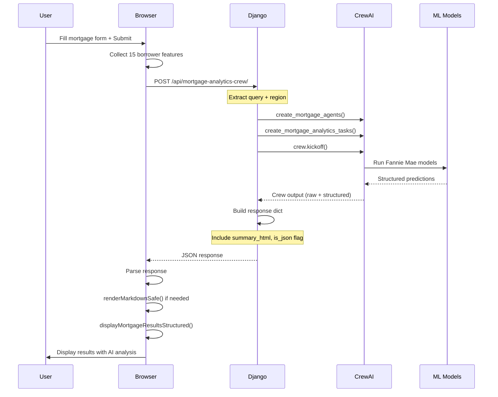

# Mortgage Analytics Crew Integration Plan

## Executive Summary

This plan outlines the integration pattern for the `mortgage_analytics` crew in the Django template, comparing it with existing implementations ([`fd_advisor.html`](Test/bank_app/templates/bank_app/fd_advisor.html), [`credit_risk.html`](Test/bank_app/templates/bank_app/credit_risk.html)) and creating a detailed implementation guide.

---

## 1. Current State Analysis

### 1.1 Existing Implementation: [`mortgage_analytics.html`](Test/bank_app/templates/bank_app/mortgage_analytics.html:1)

**Current Pattern:**
- Uses a **simple mortgage calculator** with local JavaScript calculations
- Calls the CrewAI API at line 182: `fetch('/api/mortgage-analytics-crew/', {...})`
- **Does NOT** use the unified `/api/run-crew/` endpoint pattern
- Results are displayed using a basic `displayMortgageResults()` function (line 235)
- **Missing**: Structured JSON response handling, markdown rendering, tabbed results display

**Key Code Sections:**
```javascript
// Line 159-232: calculateMortgage() function
async function calculateMortgage() {
  // Collects form data
  // Calls /api/mortgage-analytics-crew/ endpoint
  // Displays results with displayMortgageResults()
}

// Line 235-282: displayMortgageResults() function
function displayMortgageResults(monthlyPayment, totalPayment, totalInterest, homePrice, loanAmount, interestRate, termYears, crewData) {
  // Simple HTML template with basic mortgage values
}
```

### 1.2 Reference Pattern: [`fd_advisor.html`](Test/bank_app/templates/bank_app/fd_advisor.html:1)

**Integration Pattern:**
1. **API Endpoint**: Uses `/api/product-analysis/` (line 1150) - a specialized endpoint
2. **CSRF Token**: Uses `getCookie('csrftoken')` helper (line 1154)
3. **Request Format**:
   ```javascript
   {
     product_type: productType,
     amount: amount,
     tenure: tenure,
     tenure_unit: tenureUnit,
     region: getRegionName(region),
     senior_citizen: boolean,
     auto_renewal: boolean
   }
   ```
4. **Response Handling**:
   - Parses structured data from `analysisData.structured_data` (line 1178)
   - Stores pre-rendered HTML in `fdAnalysisData.summaryHtml` (line 1189)
   - Uses async `displayUnifiedResults()` for markdown rendering (line 1215)
5. **Result Display**: Tabbed interface with Summary, Provider Deep-Dive, Risk Analysis, Recommendations (lines 1662-1667)

### 1.3 Reference Pattern: [`credit_risk.html`](Test/bank_app/templates/bank_app/credit_risk.html:1)

**Integration Pattern:**
1. **API Endpoint**: Uses `/api/credit-risk-crew/` (line 1263) - legacy endpoint wrapper
2. **CSRF Token**: Uses `getCookie('csrftoken')` helper (line 1250)
3. **Request Format**:
   ```javascript
   {
     query: formData,  // Form data object
     region: region
   }
   ```
4. **Response Handling**:
   - Checks for `data.is_json` flag (line 1338)
   - Uses `data.summary_html` for pre-rendered HTML (line 1337)
   - Calls `renderStructuredResults()` for new display format (line 1347)
5. **Result Display**: Structured sections with ML Prediction, Policy Excerpts, Compliance Status (lines 1456-1572)

### 1.4 Crew Implementation: [`Test/crews.py`](Test/crews.py:355)

**`run_mortgage_analytics_crew` Function:**
```python
def run_mortgage_analytics_crew(borrower_json: str = "{}"):
    agents = create_mortgage_agents()
    tasks = create_mortgage_analytics_tasks(agents, borrower_json)
    crew = Crew(
        agents=[
            agents["mortgage_data_collector_agent"],
            agents["mortgage_anyst_agent"],
        ],
        tasks=tasks,
        process=Process.sequential,
        verbose=True,
        cache=False,
    )
    return crew.kickoff()
```

### 1.5 API View Pattern: [`crew_api_views.py`](Test/bank_app/views/crew_api_views.py:132)

**Crew Function Mapping:**
```python
CREW_FUNCTION_MAP = {
    "mortgage_analytics": (
        create_mortgage_agents,
        lambda agents, query, region: create_mortgage_analytics_tasks(agents, query),
    ),
}
```

**Legacy Endpoint Wrapper:**
```python
mortgage_analytics_crew_api = _legacy_endpoint_wrapper("mortgage_analytics")
```

This creates an endpoint at `/api/mortgage-analytics-crew/` that wraps the generic `/api/run-crew/` endpoint.

### 1.6 Streamlit Reference: [`streamlit_ref/tab_mortgage_analytics.py`](streamlit_ref/tab_mortgage_analytics.py:6)

**Key Features:**
1. **Region Gating**: US-only restriction (lines 17-72)
2. **Form Fields**: 15 borrower features including:
   - Original UPB, LTV, Interest Rate, Loan Term
   - Credit Score, DTI, Number of Borrowers
   - Loan Purpose, Property Type, Occupancy Status
   - Amortization Type, Channel, State, First-time Buyer, Modification Flag
3. **Dual Execution**:
   - Runs ML model directly via `run_mortgage_analytics(borrower_data)` (line 273)
   - Runs CrewAI for interpretation via `run_mortgage_analytics_crew(borrower_json)` (line 282)
4. **Result Structure**:
   ```python
   {
       **ml_results,  # Structured ML predictions
       "crew_analysis": crew_output,  # AI agent interpretation
   }
   ```
5. **Display**: Summary card, Key Findings, Recommendations, Credit Risk Assessment, Customer Segmentation, Portfolio Risk (lines 336-439)

---

## 2. Integration Pattern Comparison

| Feature | fd_advisor.html | credit_risk.html | mortgage_analytics.html (Current) |
|---------|-----------------|------------------|-----------------------------------|
| API Endpoint | `/api/product-analysis/` | `/api/credit-risk-crew/` | `/api/mortgage-analytics-crew/` |
| CSRF Handling | `getCookie('csrftoken')` | `getCookie('csrftoken')` | `getCookie('csrftoken')` ✓ |
| Request Format | Structured params | `{query, region}` | Structured params ✓ |
| Response Type | Structured JSON + HTML | Structured JSON + HTML | Basic JSON |
| Markdown Rendering | Async `renderMarkdownSafe()` | `renderMarkdownSafe()` + backend HTML | None |
| Result Display | Tabbed interface | Structured sections | Simple table |
| Loading State | Progress indicator | Placeholder with spinner | Placeholder ✓ |
| Error Handling | Try/catch with user feedback | Try/catch with detailed logging | Basic try/catch |

---

## 3. Required Changes for mortgage_analytics.html

### 3.1 API Endpoint Alignment

**Current:**
```javascript
fetch('/api/mortgage-analytics-crew/', {
  method: 'POST',
  headers: {
    'Content-Type': 'application/json',
    'X-CSRFToken': getCookie('csrftoken')
  },
  body: JSON.stringify({
    loan_amount: loanAmount,
    interest_rate: interestRate,
    loan_term: termYears,
    down_payment: downPayment,
    location: 'United States'
  })
})
```

**Recommended (matching credit_risk pattern):**
```javascript
fetch('/api/mortgage-analytics-crew/', {
  method: 'POST',
  headers: {
    'Content-Type': 'application/json',
    'X-CSRFToken': getCookie('csrftoken')
  },
  body: JSON.stringify({
    query: {
      original_upb: loanAmount,
      original_ltv: ltv,  // Calculate from loanAmount/homePrice
      original_interest_rate: interestRate,
      original_loan_term: termYears * 12,  // Convert to months
      borrower_credit_score: creditScore,  // Add new field
      debt_to_income: dti,  // Add new field
      number_of_borrowers: numBorrowers,  // Add new field
      loan_purpose: loanPurpose,  // Add new field
      property_type: propertyType,  // Add new field
      occupancy_status: occupancy,  // Add new field
      amortization_type: amortization,  // Add new field
      channel: channel,  // Add new field
      property_state: state,  // Add new field
      first_time_home_buyer: firstTimeBuyer,  // Add new field
      modification_flag: modification,  // Add new field
      down_payment: downPayment,
      region: 'United States'
    },
    region: 'United States'
  })
})
```

### 3.2 Form Fields Enhancement

**Current Form Fields (lines 27-66):**
- Loan Amount (slider + input)
- Interest Rate (number input)
- Loan Term (select: 15, 20, 30 years)
- Down Payment (slider + input)

**Required Additional Fields (matching Streamlit reference):**
```html
<!-- Borrower Information Section -->
<div class="section-divider">Borrower Information</div>

<div class="row2">
  <div class="field">
    <label for="credit_score">Credit Score (FICO)</label>
    <input type="number" id="credit_score" min="300" max="850" value="740">
    <span class="field-hint">300-850</span>
  </div>
  <div class="field">
    <label for="dti_ratio">Debt-to-Income Ratio (%)</label>
    <input type="number" id="dti_ratio" min="0" max="100" step="0.1" value="35">
    <span class="field-hint">Percentage</span>
  </div>
</div>

<div class="field">
  <label for="num_borrowers">Number of Borrowers</label>
  <select id="num_borrowers">
    <option value="1">1</option>
    <option value="2" selected>2</option>
    <option value="3">3</option>
    <option value="4">4</option>
    <option value="5">5</option>
  </select>
</div>

<!-- Loan Characteristics Section -->
<div class="section-divider">Loan Characteristics</div>

<div class="row2">
  <div class="field">
    <label for="loan_purpose">Loan Purpose</label>
    <select id="loan_purpose">
      <option value="Purchase" selected>Purchase</option>
      <option value="Refinance">Refinance</option>
      <option value="Cash-Out Refinance">Cash-Out Refinance</option>
    </select>
  </div>
  <div class="field">
    <label for="property_type">Property Type</label>
    <select id="property_type">
      <option value="Single Family" selected>Single Family</option>
      <option value="Condo">Condo</option>
      <option value="Townhouse">Townhouse</option>
      <option value="PUD">PUD</option>
      <option value="Manufactured Housing">Manufactured Housing</option>
    </select>
  </div>
</div>

<div class="row2">
  <div class="field">
    <label for="occupancy_status">Occupancy Status</label>
    <select id="occupancy_status">
      <option value="Owner Occupied" selected>Owner Occupied</option>
      <option value="Investor">Investor</option>
      <option value="Second Home">Second Home</option>
    </select>
  </div>
  <div class="field">
    <label for="amortization_type">Amortization Type</label>
    <select id="amortization_type">
      <option value="Fixed" selected>Fixed</option>
      <option value="ARM">ARM</option>
    </select>
  </div>
</div>

<div class="row2">
  <div class="field">
    <label for="channel">Channel</label>
    <select id="channel">
      <option value="Branch" selected>Branch</option>
      <option value="Correspondent">Correspondent</option>
      <option value="Direct">Direct</option>
    </select>
  </div>
  <div class="field">
    <label for="property_state">Property State</label>
    <select id="property_state">
      <option value="CA" selected>CA</option>
      <option value="TX">TX</option>
      <option value="FL">FL</option>
      <option value="NY">NY</option>
      <option value="IL">IL</option>
      <option value="PA">PA</option>
      <option value="OH">OH</option>
      <option value="GA">GA</option>
      <option value="NC">NC</option>
      <option value="MI">MI</option>
      <option value="NJ">NJ</option>
      <option value="VA">VA</option>
      <option value="WA">WA</option>
      <option value="AZ">AZ</option>
      <option value="MA">MA</option>
      <option value="MD">MD</option>
      <option value="CO">CO</option>
      <option value="MN">MN</option>
      <option value="OR">OR</option>
      <option value="IN">IN</option>
    </select>
  </div>
</div>

<div class="row2">
  <div class="field">
    <label for="first_time_buyer">First Time Home Buyer</label>
    <select id="first_time_buyer">
      <option value="N" selected>No</option>
      <option value="Y">Yes</option>
    </select>
  </div>
  <div class="field">
    <label for="modification_flag">Modification Flag</label>
    <select id="modification_flag">
      <option value="N" selected>No</option>
      <option value="Y">Yes</option>
    </select>
  </div>
</div>
```

### 3.3 JavaScript Changes

#### 3.3.1 Update `calculateMortgage()` Function

```javascript
// Replace lines 159-232 with enhanced version
async function calculateMortgage() {
  // Collect basic loan details
  const loanAmount = parseFloat(document.getElementById('mortgage_amount').value) || 0;
  const interestRate = parseFloat(document.getElementById('mortgage_rate').value) || 0;
  const termYears = parseInt(document.getElementById('mortgage_term').value) || 30;
  const downPayment = parseFloat(document.getElementById('down_payment').value) || 0;
  
  // Collect borrower information
  const creditScore = parseInt(document.getElementById('credit_score')?.value) || 740;
  const dti = parseFloat(document.getElementById('dti_ratio')?.value) || 35;
  const numBorrowers = parseInt(document.getElementById('num_borrowers')?.value) || 2;
  
  // Collect loan characteristics
  const loanPurpose = document.getElementById('loan_purpose')?.value || 'Purchase';
  const propertyType = document.getElementById('property_type')?.value || 'Single Family';
  const occupancyStatus = document.getElementById('occupancy_status')?.value || 'Owner Occupied';
  const amortizationType = document.getElementById('amortization_type')?.value || 'Fixed';
  const channel = document.getElementById('channel')?.value || 'Branch';
  const propertyState = document.getElementById('property_state')?.value || 'CA';
  const firstTimeBuyer = document.getElementById('first_time_buyer')?.value || 'N';
  const modificationFlag = document.getElementById('modification_flag')?.value || 'N';
  
  // Calculate LTV
  const homePrice = loanAmount + downPayment;
  const ltv = (loanAmount / homePrice) * 100;
  
  // Validation
  if (loanAmount <= 0 || interestRate <= 0 || termYears <= 0 || creditScore < 300 || creditScore > 850) {
    alert('Please enter valid mortgage details.');
    return;
  }
  
  const resultsDiv = document.getElementById('mortgage_results');
  
  // Show loading state (matching credit_risk pattern)
  resultsDiv.innerHTML = `
    <div class="placeholder">
      <div class="placeholder-icon">⏳</div>
      <p><strong>CrewAI is analyzing mortgage options...</strong></p>
      <p style="font-size: 0.85rem; color: var(--dim);">Running comprehensive mortgage analysis with Fannie Mae models</p>
    </div>
  `;
  
  try {
    // Get CSRF token
    const csrfToken = getCookie('csrftoken');
    
    // Prepare payload matching credit_risk pattern
    const payload = {
      query: {
        original_upb: loanAmount,
        original_ltv: ltv,
        original_interest_rate: interestRate,
        original_loan_term: termYears * 12,  // Convert to months
        borrower_credit_score: creditScore,
        debt_to_income: dti,
        number_of_borrowers: numBorrowers,
        loan_purpose: loanPurpose,
        property_type: propertyType,
        occupancy_status: occupancyStatus,
        amortization_type: amortizationType,
        channel: channel,
        property_state: propertyState,
        first_time_home_buyer_indicator: firstTimeBuyer,
        modification_flag: modificationFlag,
        down_payment: downPayment,
        region: 'United States'
      },
      region: 'United States'
    };
    
    const response = await fetch('/api/mortgage-analytics-crew/', {
      method: 'POST',
      headers: {
        'Content-Type': 'application/json',
        'X-CSRFToken': csrfToken || ''
      },
      body: JSON.stringify(payload)
    });
    
    const data = await response.json();
    
    if (data.error) {
      resultsDiv.innerHTML = `
        <div class="placeholder">
          <div class="placeholder-icon">❌</div>
          <p><strong>Error:</strong> ${data.error}</p>
          ${data.detail ? `<p style="font-size: 0.8rem; color: var(--dim);">Details: ${data.detail}</p>` : ''}
        </div>
      `;
      return;
    }
    
    // Display results using new structured format
    displayMortgageResultsStructured(data, {
      loanAmount, interestRate, termYears, downPayment,
      creditScore, dti, ltv, homePrice
    });
    
  } catch (error) {
    console.error('Mortgage Analytics error:', error);
    
    // Fallback to local calculation
    const monthlyRate = interestRate / 100 / 12;
    const numPayments = termYears * 12;
    const monthlyPayment = loanAmount * monthlyRate * Math.pow(1 + monthlyRate, numPayments) / (Math.pow(1 + monthlyRate, numPayments) - 1);
    const totalPayment = monthlyPayment * numPayments;
    const totalInterest = totalPayment - loanAmount;
    
    displayMortgageResults(monthlyPayment, totalPayment, totalInterest, homePrice, loanAmount, interestRate, termYears, null);
  }
}
```

#### 3.3.2 Add New `displayMortgageResultsStructured()` Function

```javascript
// Add after displayMortgageResults() function
function displayMortgageResultsStructured(data, basicValues) {
  const resultsDiv = document.getElementById('mortgage_results');
  
  const rawOutput = data.result || '';
  const summaryHtml = data.summary_html || '';
  const isJson = data.is_json === true || data.is_json === 'true';
  
  // Check if we have structured JSON data
  if (isJson && data.processed_features) {
    renderStructuredMortgageResults(data, basicValues);
    return;
  }
  
  // Use backend-rendered HTML if available
  let analysisHtml = '';
  if (summaryHtml && summaryHtml.trim() !== '') {
    analysisHtml = summaryHtml;
  } else if (typeof renderMarkdownSafe === 'function') {
    analysisHtml = renderMarkdownSafe(rawOutput);
  } else {
    // Fallback to async rendering
    renderMarkdown(rawOutput).then(html => {
      analysisHtml = html;
      updateMortgageAnalysisDisplay(html);
    });
  }
  
  // Calculate basic values for display
  const monthlyRate = basicValues.interestRate / 100 / 12;
  const numPayments = basicValues.termYears * 12;
  const monthlyPayment = basicValues.loanAmount * monthlyRate * Math.pow(1 + monthlyRate, numPayments) / (Math.pow(1 + monthlyRate, numPayments) - 1);
  const totalPayment = monthlyPayment * numPayments;
  const totalInterest = totalPayment - basicValues.loanAmount;
  
  resultsDiv.innerHTML = `
    <div class="rp-title">Mortgage Analysis (CrewAI Enhanced)</div>
    
    <!-- Basic Payment Summary -->
    <div class="emi-table">
      <div class="emi-row">
        <span class="emi-label">Home Price</span>
        <span class="emi-value big">$${basicValues.homePrice.toLocaleString('en-US', {maximumFractionDigits: 0})}</span>
      </div>
      <div class="emi-row">
        <span class="emi-label">Down Payment</span>
        <span class="emi-value">$${basicValues.downPayment.toLocaleString('en-US', {maximumFractionDigits: 0})}</span>
      </div>
      <div class="emi-row">
        <span class="emi-label">Loan Amount</span>
        <span class="emi-value">$${basicValues.loanAmount.toLocaleString('en-US', {maximumFractionDigits: 0})}</span>
      </div>
      <div class="emi-row">
        <span class="emi-label">Interest Rate</span>
        <span class="emi-value">${basicValues.interestRate}%</span>
      </div>
      <div class="emi-row">
        <span class="emi-label">Loan Term</span>
        <span class="emi-value">${basicValues.termYears} years</span>
      </div>
    </div>
    
    <div class="section-divider" style="margin-top: 20px;">Monthly Payment</div>
    <div style="text-align: center; padding: 20px 0;">
      <div style="font-family: 'DM Mono', monospace; font-size: 2.5rem; font-weight: 600; color: var(--gold);">$${monthlyPayment.toLocaleString('en-US', {minimumFractionDigits: 2, maximumFractionDigits: 2})}</div>
      <div style="color: var(--muted); font-size: 0.85rem; margin-top: 8px;">per month</div>
    </div>
    
    <div class="section-divider" style="margin-top: 20px;">Total Cost</div>
    <div class="emi-table">
      <div class="emi-row">
        <span class="emi-label">Total Interest</span>
        <span class="emi-value red">$${totalInterest.toLocaleString('en-US', {maximumFractionDigits: 0})}</span>
      </div>
      <div class="emi-row">
        <span class="emi-label">Total Payment</span>
        <span class="emi-value big">$${totalPayment.toLocaleString('en-US', {maximumFractionDigits: 0})}</span>
      </div>
    </div>
    
    <!-- CrewAI Analysis Section -->
    <div class="section-divider" style="margin-top: 20px;">AI Agent Analysis</div>
    <div class="creditwise-card summary-card" style="max-height: 400px; overflow-y: auto; font-size: 0.85rem;">
      <div class="analysis-content" style="padding: 16px;">
        ${analysisHtml || '<p>Analysis unavailable</p>'}
      </div>
    </div>
    
    <div style="margin-top: 12px; font-size: 0.75rem; color: var(--dim);">
      🤖 Powered by CrewAI + Fannie Mae Models | Timestamp: ${data.timestamp || new Date().toISOString()}
    </div>
  `;
}

// Add structured JSON rendering function
function renderStructuredMortgageResults(data, basicValues) {
  const resultsDiv = document.getElementById('mortgage_results');
  
  const features = data.processed_features || {};
  const summary = data.summary || {};
  const analyses = data.analyses || {};
  
  // Calculate basic values
  const monthlyRate = basicValues.interestRate / 100 / 12;
  const numPayments = basicValues.termYears * 12;
  const monthlyPayment = basicValues.loanAmount * monthlyRate * Math.pow(1 + monthlyRate, numPayments) / (Math.pow(1 + monthlyRate, numPayments) - 1);
  const totalPayment = monthlyPayment * numPayments;
  const totalInterest = totalPayment - basicValues.loanAmount;
  
  // Determine risk level
  const overallRisk = summary.overall_risk || 'MEDIUM';
  const riskColor = overallRisk === 'LOW' ? '#16A34A' : overallRisk === 'MEDIUM' ? '#EAB308' : '#DC2626';
  const riskBg = overallRisk === 'LOW' ? '#DCFCE7' : overallRisk === 'MEDIUM' ? '#FEF9C3' : '#FEE2E2';
  const riskIcon = overallRisk === 'LOW' ? '✓' : overallRisk === 'MEDIUM' ? '⚠' : '✗';
  
  let html = `
    <div class="rp-title">Mortgage Analytics Results</div>
    
    <!-- Risk Assessment Summary -->
    <div style="background:${riskBg}; border:1px solid ${riskColor}; border-radius:8px; padding:16px; margin-bottom:16px;">
      <div style="display:flex; align-items:center; gap:12px;">
        <div style="width:40px; height:40px; background:${riskColor}; border-radius:50%; display:flex; align-items:center; justify-content:center;">
          <span style="color:white; font-weight:bold; font-size:18px;">${riskIcon}</span>
        </div>
        <div>
          <div style="font-size:14px; color:#64748B;">Overall Risk Assessment</div>
          <div style="font-size:24px; font-weight:700; color:${riskColor};">${overallRisk}</div>
        </div>
      </div>
    </div>
    
    <!-- Key Findings -->
    ${summary.key_findings && summary.key_findings.length > 0 ? `
      <div class="section-divider">Key Findings</div>
      <ul style="color: var(--text); padding-left: 20px;">
        ${summary.key_findings.map(finding => `<li style="margin: 8px 0;">${finding}</li>`).join('')}
      </ul>
    ` : ''}
    
    <!-- Recommendations -->
    ${summary.recommendations && summary.recommendations.length > 0 ? `
      <div class="section-divider">Recommendations</div>
      <ul style="color: var(--text); padding-left: 20px;">
        ${summary.recommendations.map(rec => `<li style="margin: 8px 0;">${rec}</li>`).join('')}
      </ul>
    ` : ''}
    
    <!-- Basic Payment Summary -->
    <div class="section-divider">Payment Summary</div>
    <div class="emi-table">
      <div class="emi-row">
        <span class="emi-label">Monthly Payment</span>
        <span class="emi-value big">$${monthlyPayment.toLocaleString('en-US', {minimumFractionDigits: 2, maximumFractionDigits: 2})}</span>
      </div>
      <div class="emi-row">
        <span class="emi-label">Total Interest</span>
        <span class="emi-value red">$${totalInterest.toLocaleString('en-US', {maximumFractionDigits: 0})}</span>
      </div>
      <div class="emi-row">
        <span class="emi-label">Total Payment</span>
        <span class="emi-value big">$${totalPayment.toLocaleString('en-US', {maximumFractionDigits: 0})}</span>
      </div>
    </div>
  `;
  
  // Add credit risk assessment if available
  if (analyses.credit_risk && !analyses.credit_risk.error) {
    const cr = analyses.credit_risk;
    html += `
      <div class="section-divider">Credit Risk Assessment</div>
      <div class="emi-table">
        <div class="emi-row">
          <span class="emi-label">Prediction</span>
          <span class="emi-value">${cr.prediction_label || 'N/A'}</span>
        </div>
        <div class="emi-row">
          <span class="emi-label">Risk Level</span>
          <span class="emi-value">${cr.risk_level || 'N/A'}</span>
        </div>
        <div class="emi-row">
          <span class="emi-label">Delinquency Probability</span>
          <span class="emi-value">${(cr.probability || 0).toFixed(1)}%</span>
        </div>
        <div class="emi-row">
          <span class="emi-label">Confidence</span>
          <span class="emi-value">${((cr.confidence || 0) * 100).toFixed(1)}%</span>
        </div>
      </div>
    `;
  }
  
  // Add customer segmentation if available
  if (analyses.customer_segmentation && !analyses.customer_segmentation.error) {
    const seg = analyses.customer_segmentation;
    html += `
      <div class="section-divider">Customer Segmentation</div>
      <div class="emi-table">
        <div class="emi-row">
          <span class="emi-label">Segment</span>
          <span class="emi-value">${seg.cluster_label || 'N/A'}</span>
        </div>
        <div class="emi-row">
          <span class="emi-label">Cluster ID</span>
          <span class="emi-value">${seg.cluster || 'N/A'}</span>
        </div>
      </div>
    `;
  }
  
  // Add input features
  if (Object.keys(features).length > 0) {
    html += `
      <div class="section-divider">Input Features</div>
      <div style="display: grid; grid-template-columns: repeat(3, 1fr); gap: 8px; font-size: 0.8rem;">
        ${Object.entries(features).map(([key, value]) => `
          <div style="background: rgba(255,255,255,0.03); padding: 8px; border-radius: 4px;">
            <div style="color: var(--dim);">${key.replace(/_/g, ' ').replace(/\b\w/g, l => l.toUpperCase())}</div>
            <div style="color: var(--gold); font-weight: 600;">${value}</div>
          </div>
        `).join('')}
      </div>
    `;
  }
  
  // Add crew analysis if available
  if (data.crew_analysis) {
    let crewAnalysisHtml = '';
    if (typeof renderMarkdownSafe === 'function') {
      crewAnalysisHtml = renderMarkdownSafe(data.crew_analysis);
    } else {
      crewAnalysisHtml = data.crew_analysis;
    }
    
    html += `
      <div class="section-divider">AI Agent Analysis Report</div>
      <div class="creditwise-card summary-card" style="max-height: 400px; overflow-y: auto; font-size: 0.85rem;">
        <div class="analysis-content" style="padding: 16px;">
          ${crewAnalysisHtml}
        </div>
      </div>
    `;
  }
  
  html += `
    <div style="margin-top: 12px; font-size: 0.75rem; color: var(--dim);">
      🤖 Powered by CrewAI + Fannie Mae Models | Timestamp: ${data.timestamp || new Date().toISOString()}
    </div>
  `;
  
  resultsDiv.innerHTML = html;
}

// Helper function to update analysis display after async rendering
function updateMortgageAnalysisDisplay(html) {
  const analysisContent = document.querySelector('.analysis-content');
  if (analysisContent) {
    analysisContent.innerHTML = html;
  }
}
```

---

## 4. Backend Changes Required

### 4.1 Verify API View Configuration

**Check [`crew_api_views.py`](Test/bank_app/views/crew_api_views.py:132):**
```python
# Already configured in CREW_FUNCTION_MAP
"mortgage_analytics": (
    create_mortgage_agents,
    lambda agents, query, region: create_mortgage_analytics_tasks(agents, query),
),

# Legacy endpoint wrapper already exists
mortgage_analytics_crew_api = _legacy_endpoint_wrapper("mortgage_analytics")
```

### 4.2 Verify URL Configuration

**Check [`Test/bank_app/urls.py`](Test/bank_app/urls.py):**
Ensure the following URL pattern exists:
```python
path('api/mortgage-analytics-crew/', mortgage_analytics_crew_api, name='mortgage_analytics_crew_api'),
```

### 4.3 Enhance Backend Response (Optional)

To match the [`credit_risk`](Test/bank_app/views/credit_risk_views.py) pattern with structured JSON and pre-rendered HTML:

**In the mortgage analytics view:**
```python
# After crew execution
result = {
    "success": True,
    "result": output.raw,
    "is_json": True,  # Flag for structured response
    "processed_features": features_dict,
    "summary": summary_dict,
    "analyses": {
        "credit_risk": credit_risk_result,
        "customer_segmentation": segmentation_result,
        "portfolio_risk": portfolio_risk_result,
    },
    "crew_analysis": crew_output,
    "summary_html": render_markdown_to_html(crew_output),  # Pre-rendered HTML
    "timestamp": datetime.now().isoformat(),
}
```

---

## 5. Implementation Checklist

### Phase 1: Template Updates
- [ ] Add new form fields to [`mortgage_analytics.html`](Test/bank_app/templates/bank_app/mortgage_analytics.html:1) (borrower info, loan characteristics)
- [ ] Update `calculateMortgage()` function to collect all 15 features
- [ ] Update API request payload format to match credit_risk pattern
- [ ] Add `displayMortgageResultsStructured()` function
- [ ] Add `renderStructuredMortgageResults()` function
- [ ] Add `updateMortgageAnalysisDisplay()` helper function
- [ ] Ensure `renderMarkdownSafe` is available (check base.html or markdown_renderer.js)

### Phase 2: Backend Verification
- [ ] Verify [`mortgage_analytics_crew_api`](Test/bank_app/views/crew_api_views.py:344) endpoint is registered in URLs
- [ ] Verify `create_mortgage_agents()` and `create_mortgage_analytics_tasks()` are properly implemented
- [ ] Test endpoint with sample borrower data
- [ ] Optionally enhance response to include `summary_html` pre-rendered HTML

### Phase 3: Testing
- [ ] Test form submission with valid data
- [ ] Test error handling (invalid data, API failures)
- [ ] Test markdown rendering in results
- [ ] Test structured JSON response handling
- [ ] Verify CSRF token handling works correctly
- [ ] Test with different borrower profiles

---

## 6. Architecture Diagram



---

## 7. Key Differences Summary

| Aspect | Current mortgage_analytics | Target Pattern (credit_risk style) |
|--------|---------------------------|-----------------------------------|
| **Form Fields** | 4 basic fields | 15 comprehensive borrower features |
| **API Request** | Simple params object | `{query: {...}, region: ...}` |
| **Response Handling** | Basic JSON parsing | Structured JSON + HTML fallback |
| **Markdown** | None | `renderMarkdownSafe()` + backend HTML |
| **Result Display** | Simple table | Structured sections with risk assessment |
| **ML Integration** | Local JS calculations | Fannie Mae models + CrewAI analysis |
| **Error Handling** | Basic try/catch | Detailed logging + user feedback |

---

## 8. Files to Modify

1. **[`Test/bank_app/templates/bank_app/mortgage_analytics.html`](Test/bank_app/templates/bank_app/mortgage_analytics.html:1)** - Main template changes
   - Add new form fields (borrower info, loan characteristics)
   - Update `calculateMortgage()` function
   - Add new display functions

2. **[`Test/bank_app/views/crew_api_views.py`](Test/bank_app/views/crew_api_views.py:1)** - Verify configuration (no changes likely needed)

3. **[`Test/bank_app/urls.py`](Test/bank_app/urls.py:1)** - Verify endpoint registration (no changes likely needed)

4. **Optional: Backend view enhancement** - Add `summary_html` pre-rendering if not already present

---

## 9. Notes

- The current `/api/mortgage-analytics-crew/` endpoint already exists via the legacy wrapper pattern
- CSRF token handling is already implemented correctly in the current template
- The main changes are:
  1. Expanding form fields to capture all 15 borrower features
  2. Updating the request payload format
  3. Adding structured response handling
  4. Implementing markdown rendering for AI analysis
  5. Creating a more comprehensive results display

- The Streamlit reference shows the expected data flow: ML models first, then CrewAI interpretation
- Consider implementing similar dual-execution pattern in backend if not already present
