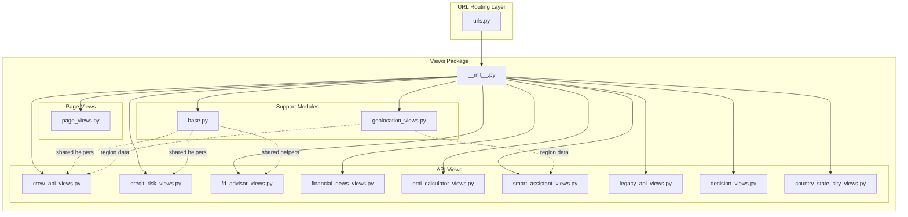

# Django Views Modularization Plan

## Current State Analysis

### [`views.py`](Test/bank_app/views.py:1) - 2321 lines
The file contains the following functional areas:

| Section | Lines | Description |
|---------|-------|-------------|
| Imports & Configuration | 1-132 | CrewAI imports, model paths, logging setup |
| Geolocation Helpers | 133-194 | `get_user_region_from_session()`, `update_user_session_with_region()` |
| Helper Functions | 195-212 | `parse_crew_output()`, `format_crew_response()` |
| Page Renderers | 213-256 | `home()`, `credit_risk()`, `fd_advisor()`, etc. (8 views) |
| Countries-States-Cities API | 257-341 | `get_countries_api()`, `get_states_api()`, `get_cities_api()` |
| CrewAI Endpoints (11 total) | 342-1220 | FD Advisor, Credit Risk, AML, Financial News, Router, Loan Creation, Mortgage Analytics, FD Template, Visualization, Analysis, Database |
| Legacy API Endpoints | 1221-1645 | Credit risk, KYC, compliance, RAG, FD rates, mortgage calculator, EMI |
| Geolocation API | 1646-1731 | `user_region_api()`, `set_region_api()` |
| CrewAI Decision Endpoint | 1732-1909 | `loan_crewai_decision_api()` |
| Smart Assistant | 1910-2025 | Chat interface and query API |
| TD/FD Creation | 2026-2321 | `td_fd_creation_api()`, `send_fd_confirmation_email()` |

### [`admin_views.py`](Test/bank_app/admin_views.py:1) - 1090 lines
Contains admin panel views organized by feature:

| Section | Lines | Description |
|---------|-------|-------------|
| Admin Authentication | 23-59 | Login/logout decorators and views |
| Dashboard | 61-131 | `admin_dashboard()` |
| User Management | 132-199 | List, detail, toggle active |
| Transaction Monitoring | 201-317 | List, detail, approve/reject |
| Analytics | 318-369 | `admin_analytics()` |
| Configuration | 370-405 | Config management |
| Audit Trail | 406-456 | Audit log viewing |
| Crew AI Logs | 457-485 | CrewAI reasoning logs |
| Content Management | 486-536 | FD rates management |
| Email Campaigns | 537-887 | Campaign creation, sending, tracking |
| Database Query Interface | 888-1126 | Natural language query interface |

## Proposed Modular Structure

```
Test/bank_app/views/
├── __init__.py              # Re-exports for backward compatibility
├── base.py                  # Shared helpers, constants, imports
├── page_views.py            # Page rendering views
├── geolocation_views.py     # Geolocation helpers and APIs
├── country_state_city_views.py  # Countries-States-Cities API
├── crew_api_views.py        # All CrewAI endpoints (11 views)
├── credit_risk_views.py     # Credit risk assessment views
├── fd_advisor_views.py      # FD advisor and TD/FD creation
├── financial_news_views.py  # Financial news API
├── emi_calculator_views.py  # EMI calculator views
├── smart_assistant_views.py # Smart assistant chat
├── legacy_api_views.py      # Legacy API for backward compatibility
└── decision_views.py        # Loan decision endpoints
```

## Module Breakdown

### 1. [`base.py`](Test/bank_app/views/base.py:1)
**Purpose**: Shared utilities, constants, and imports

**Contents**:
- Common imports (logging, JSON, datetime, etc.)
- CrewAI import handling with fallbacks
- Model path constants
- Helper functions: `parse_crew_output()`, `format_crew_response()`
- Geolocation helper functions (moved from main file)

### 2. [`page_views.py`](Test/bank_app/views/page_views.py:1)
**Purpose**: Simple page rendering views

**Views**:
- `home()`
- `credit_risk()`
- `fd_advisor()`
- `mortgage_analytics()`
- `emi_calculator()`
- `emi()`
- `financial_news()`
- `new_account()`
- `smart_assistant()`

### 3. [`geolocation_views.py`](Test/bank_app/views/geolocation_views.py:1)
**Purpose**: Geolocation-related views and APIs

**Views**:
- `user_region_api()` (GET)
- `set_region_api()` (POST)

**Helpers** (moved from main file):
- `get_user_region_from_session()`
- `update_user_session_with_region()`

### 4. [`country_state_city_views.py`](Test/bank_app/views/country_state_city_views.py:1)
**Purpose**: Countries-States-Cities API endpoints

**Views**:
- `get_countries_api()` (GET)
- `get_states_api()` (GET)
- `get_cities_api()` (GET)

### 5. [`crew_api_views.py`](Test/bank_app/views/crew_api_views.py:1)
**Purpose**: All CrewAI-powered API endpoints

**Views** (11 endpoints):
- `fd_advisor_crew_api()` - FD rate analysis
- `credit_risk_crew_api()` - ML + CrewAI credit assessment
- `aml_crew_api()` - AML/KYC verification
- `financial_news_crew_api()` - News analysis
- `router_crew_api()` - Intent classification
- `loan_creation_crew_api()` - Loan underwriting
- `mortgage_analytics_crew_api()` - Mortgage calculations
- `fd_template_crew_api()` - FD template generation
- `visualization_crew_api()` - Chart generation
- `analysis_crew_api()` - Data analysis
- `database_crew_api()` - SQL query generation

### 6. [`credit_risk_views.py`](Test/bank_app/views/credit_risk_views.py:1)
**Purpose**: Credit risk assessment endpoints

**Views**:
- `credit_risk_indian_api()` - Indian model
- `credit_risk_us_api()` - US model
- `credit_risk_api()` - General endpoint (routes to Indian)

### 7. [`fd_advisor_views.py`](Test/bank_app/views/fd_advisor_views.py:1)
**Purpose**: FD-related endpoints

**Views**:
- `fd_rates_api()` - Get FD rates
- `td_fd_creation_api()` - Create FD/TD
- `send_fd_confirmation_email()` - Email helper

### 8. [`financial_news_views.py`](Test/bank_app/views/financial_news_views.py:1)
**Purpose**: Financial news endpoints

**Views**:
- `financial_news_api()` - NewsData.io integration
- `countries_api()` - Get available countries

### 9. [`emi_calculator_views.py`](Test/bank_app/views/emi_calculator_views.py:1)
**Purpose**: EMI and mortgage calculator endpoints

**Views**:
- `emi_calculator_api()` - EMI calculation
- `mortgage_calculator_api()` - Mortgage calculation
- `loan_application_api()` - Loan application submission

### 10. [`smart_assistant_views.py`](Test/bank_app/views/smart_assistant_views.py:1)
**Purpose**: Smart assistant chat interface

**Views**:
- `smart_assistant()` - Chat page renderer
- `smart_assistant_query()` - Query API endpoint

### 11. [`legacy_api_views.py`](Test/bank_app/views/legacy_api_views.py:1)
**Purpose**: Legacy endpoints for backward compatibility

**Views**:
- `kyc_verify_api()` - KYC verification
- `compliance_check_api()` - AML/PEP check
- `rag_query_api()` - RAG engine query

### 12. [`decision_views.py`](Test/bank_app/views/decision_views.py:1)
**Purpose**: Loan decision endpoints

**Views**:
- `loan_crewai_decision_api()` - Automated CrewAI decision

## URL Configuration Changes

### Current [`urls.py`](Test/bank_app/urls.py:1) Pattern:
```python
from . import views

urlpatterns = [
    path('api/fd-advisor-crew/', views.fd_advisor_crew_api),
    # ... 40+ more paths
]
```

### New Pattern:
```python
from django.urls import path
from .views import page_views, geolocation_views, crew_api_views
from .views import credit_risk_views, fd_advisor_views, smart_assistant_views

urlpatterns = [
    # Page views
    path('', page_views.home, name='home'),
    path('credit-risk/', page_views.credit_risk, name='credit_risk'),
    
    # Geolocation
    path('api/user-region/', geolocation_views.user_region_api),
    path('api/set-region/', geolocation_views.set_region_api),
    
    # CrewAI APIs
    path('api/fd-advisor-crew/', crew_api_views.fd_advisor_crew_api),
    path('api/credit-risk-crew/', crew_api_views.credit_risk_crew_api),
    # ... other crew APIs
    
    # Credit risk
    path('api/credit-risk/us/', credit_risk_views.credit_risk_us_api),
    
    # FD advisor
    path('api/fd-rates/', fd_advisor_views.fd_rates_api),
    path('api/td-fd-creation/', fd_advisor_views.td_fd_creation_api),
    
    # Smart assistant
    path('smart-assistant/', smart_assistant_views.smart_assistant),
    path('api/smart-assistant-query/', smart_assistant_views.smart_assistant_query),
]
```

## Backward Compatibility Strategy

The [`__init__.py`](Test/bank_app/views/__init__.py:1) file will re-export all views from their new locations:

```python
# Re-export for backward compatibility
from .page_views import *
from .geolocation_views import *
from .crew_api_views import *
from .credit_risk_views import *
from .fd_advisor_views import *
from .financial_news_views import *
from .emi_calculator_views import *
from .smart_assistant_views import *
from .legacy_api_views import *
from .decision_views import *
from .country_state_city_views import *
from .base import *
```

This ensures existing imports like `from . import views` and `views.fd_advisor_crew_api` continue to work.

## Mermaid Architecture Diagram



## Implementation Steps

1. **Create directory structure**: `Test/bank_app/views/`
2. **Create [`base.py`](Test/bank_app/views/base.py:1)**: Extract shared imports and helpers
3. **Create [`page_views.py`](Test/bank_app/views/page_views.py:1)**: Move page rendering views
4. **Create [`geolocation_views.py`](Test/bank_app/views/geolocation_views.py:1)**: Move geolocation views/helpers
5. **Create [`country_state_city_views.py`](Test/bank_app/views/country_state_city_views.py:1)**: Move country API views
6. **Create [`crew_api_views.py`](Test/bank_app/views/crew_api_views.py:1)**: Move all 11 CrewAI endpoints
7. **Create [`credit_risk_views.py`](Test/bank_app/views/credit_risk_views.py:1)**: Move credit risk views
8. **Create [`fd_advisor_views.py`](Test/bank_app/views/fd_advisor_views.py:1)**: Move FD-related views
9. **Create [`financial_news_views.py`](Test/bank_app/views/financial_news_views.py:1)**: Move news views
10. **Create [`emi_calculator_views.py`](Test/bank_app/views/emi_calculator_views.py:1)**: Move EMI/mortgage views
11. **Create [`smart_assistant_views.py`](Test/bank_app/views/smart_assistant_views.py:1)**: Move assistant views
12. **Create [`legacy_api_views.py`](Test/bank_app/views/legacy_api_views.py:1)**: Move legacy endpoints
13. **Create [`decision_views.py`](Test/bank_app/views/decision_views.py:1)**: Move decision endpoints
14. **Create [`__init__.py`](Test/bank_app/views/__init__.py:1)**: Set up re-exports
15. **Update [`urls.py`](Test/bank_app/urls.py:1)**: Update imports (optional - backward compat allows old style)
16. **Test**: Verify all endpoints work

## Benefits

1. **Improved maintainability**: Each file < 400 lines vs 2321 lines
2. **Better discoverability**: Find related views in same file
3. **Easier testing**: Test each module independently
4. **Reduced merge conflicts**: Developers work on different files
5. **Clearer separation of concerns**: Each module has single responsibility
6. **Backward compatible**: Existing code continues to work

## Admin Views Consideration

The [`admin_views.py`](Test/bank_app/admin_views.py:1) file (1090 lines) could similarly be modularized, but it's less critical since:
- Admin views are less frequently modified
- It's already somewhat organized by feature sections
- Can be deferred to a future refactoring

If modularizing admin views, similar structure:
```
Test/bank_app/admin/
├── __init__.py
├── base.py           # Decorators, helpers
├── dashboard_views.py
├── user_views.py
├── transaction_views.py
├── analytics_views.py
├── campaign_views.py
└── query_views.py
```

## Risk Mitigation

1. **Testing**: Run existing tests after each module creation
2. **Gradual rollout**: Create modules one at a time, verify imports work
3. **Backward compatibility**: Keep `__init__.py` re-exports until confirmed no external dependencies
4. **URL verification**: Test each endpoint after migration
